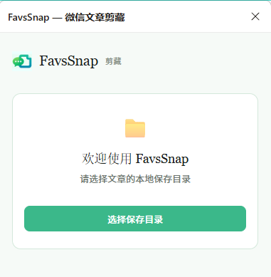
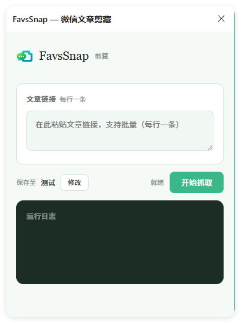

# FavsSnap — 微信文章剪藏 (Chrome 扩展)

将微信公众号文章一键转为 Markdown + 本地图片，支持批量剪藏。

**FavsSnap** 是一款浏览器扩展，基于 Chrome Extension Manifest V3 开发，直接运行在浏览器侧边栏中，无需安装 Python 或其他运行时。

> 另有桌面版（Python GUI）：[huanyu-a/FavsSnap](https://github.com/huanyu-a/FavsSnap)

## 功能特性

- **Markdown 转换**：自动将文章正文转为标准 Markdown 格式，支持标题、加粗、斜体、代码块、列表、引用等
- **图片本地化**：自动下载文章中的所有图片到本地文件夹，Markdown 中引用本地路径
- **批量剪藏**：支持一次粘贴多条链接，逐条处理，带进度条和百分比显示
- **贴图文章支持**：自动识别图文卡片类文章（贴图文章），提取文案和幻灯片图片
- **元信息保留**：自动提取标题、作者、发布时间，写入 Markdown 头部
- **右键菜单**：在微信文章页面右键 → 「剪藏到 FavsSnap」快速打开
- **键盘快捷键**：支持快捷键快速剪藏当前页面（可自定义）
- **自动填充链接**：切换到微信文章页面时自动填充当前链接
- **持久化目录**：保存目录选择一次，后续使用无需重复选择
- **薄荷绿主题**：圆角卡片布局，简洁清爽的视觉风格

## 安装

### 从源码加载（开发者模式）

1. 下载本仓库代码到本地
2. 打开 Chrome，访问 `chrome://extensions`
3. 开启右上角的「**开发者模式**」
4. 点击「**加载已解压的扩展程序**」
5. 选择本项目所在的文件夹



6. 安装成功后，Chrome 工具栏会出现 FavsSnap 图标

### 使用

点击工具栏图标，侧边栏将在右侧打开：



## 使用方法

### 第一步：选择保存目录

首次使用时点击「选择保存目录」按钮，选取一个本地文件夹用于存放文章和图片。该选择会被记住，下次打开无需重新设置。

可在设置页面（扩展管理 → 详细信息 → 扩展选项）中随时更改或清除保存目录。

### 第二步：剪藏文章

1. 在微信中打开目标文章（`mp.weixin.qq.com` 格式）
2. 链接会自动填入侧边栏，或手动复制链接粘贴到输入框（支持批量，每行一条）
3. 点击「开始抓取」

### 快捷操作

| 方式 | 说明 |
|------|------|
| 右键菜单 | 在微信文章页空白处右键 → 「剪藏到 FavsSnap」 |
| 键盘快捷键 | 可在 `chrome://extensions/shortcuts` 中配置 |
| 工具栏图标 | 点击 FavsSnap 图标打开侧边栏 |

### 输出结构

```
保存目录/
├── 文章标题A.md
├── 文章标题B.md
└── images/
    └── 文章标题A/
        ├── img_A01_001_xxxxxxxx.jpg    ← 第1篇第1张
        ├── img_A01_002_xxxxxxxx.png    ← 第1篇第2张
        └── ...
```

图片文件名格式：`img_A{文章序号}_{图片序号}_{哈希}.{扩展名}`，方便区分不同文章的图片。

### Markdown 输出格式

```markdown
# 文章标题

**作者**: 作者名
**发布时间**: 2026-05-21
**原文链接**: https://mp.weixin.qq.com/s/xxx
**抓取时间**: 2026-05-21 14:00:00

---

正文内容（Markdown 格式）


```

## 支持的文章类型

| 类型 | 说明 |
|------|------|
| 普通文章 | 标准图文混排，完整转换正文和图片 |
| 贴图文章 | 图文卡片/幻灯片类文章，提取文案和全部幻灯片图片 |

## 技术栈

- **Manifest V3** — Chrome Extension 最新标准
- **File System Access API** — 直接读写本地文件系统
- **IndexedDB** — 持久化保存目录权限句柄
- **原生 JavaScript** — 无第三方依赖，轻量高效

## 权限说明

| 权限 | 用途 |
|------|------|
| `sidePanel` | 在浏览器右侧打开剪藏面板 |
| `storage` | 存储扩展配置 |
| `scripting` + `activeTab` | 读取当前页面信息 |
| `contextMenus` | 提供右键菜单快捷操作 |
| `mp.weixin.qq.com` | 抓取微信文章内容 |
| `*.qpic.cn` | 下载微信文章中的图片 |

## 关键词

微信公众号 · 微信文章 · 文章剪藏 · 剪藏工具 · 本地保存 · Markdown转换 · 图片本地化 · 批量抓取 · 贴图文章 · 公众号文章保存 · Chrome扩展 · 浏览器扩展 · 侧边栏

## About

FavsSnap 微信公众号文章剪藏工具 —— 将微信文章一键转为 Markdown + 本地图片。

官网：https://www.bx9y.com.cn/
